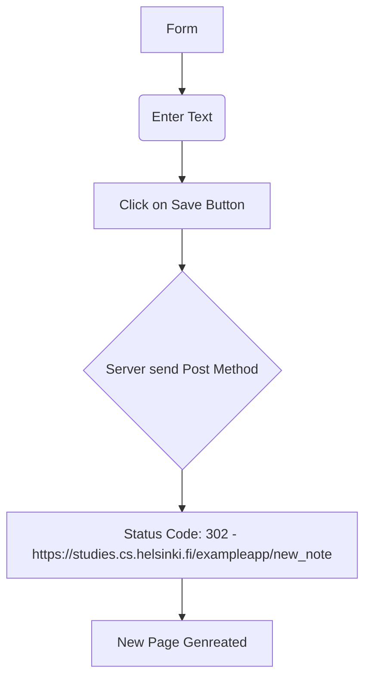

## New note diagram

```mermaid
graph TD
    A[Form] --> B(Enter Text) 
    B-->C[Click on Save Button]
    C--> D{Server send Post Method}
    D --> E[Status Code: 302 - https://studies.cs.helsinki.fi/exampleapp/new_note]
    E --> F[New Page Genreated ]
```