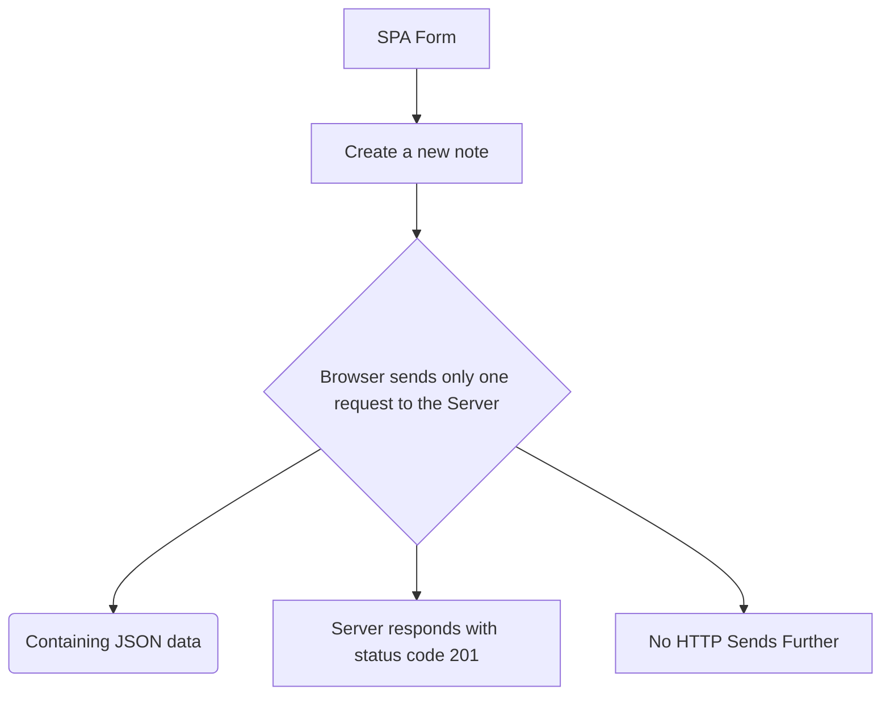

## Single page app

```mermaid
flowchart TB
a[SPA Form] --> b[Create a new note]
b --> c{Browser sends only one request to the Server}
c --> d(Containing JSON data)
c--> e[Server responds with status code 201]
c -->f[ No HTTP Sends Further]
```